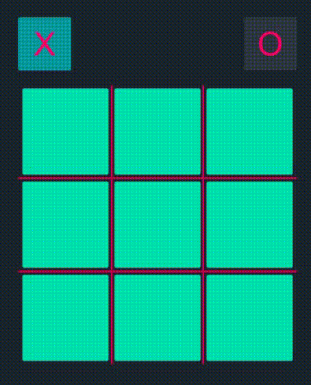

# Tic-Tac-Toe

A tic-tac-toe game made in Unity. [Link](https://learn.unity.com/tutorial/creating-a-tic-tac-toe-game-using-only-ui-components#) to tutorial for the 2 player version of the game.

Key features:

1. Uses only the UI features of Unity.
2. GameAI Implemented using Minimax Algorithm.

## Gameplay

